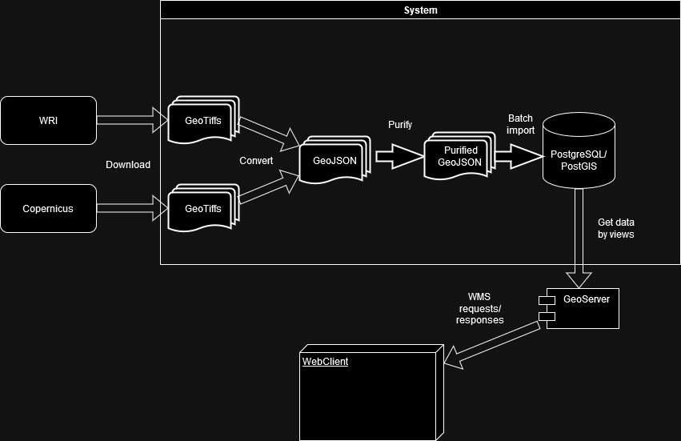

# Теоретичне завдання:

## Огляд доступних наборів даних:

1. https://www.wri.org/resources/data-sets/aqueduct-floods-hazard-maps

Перший набір даних являє собою проект Aqueduct від World Resources Institute. Цей проєкт вимірює і картографує ризики, пов'язані з водою, в усьому світі, оцінюючи поточні та майбутні ризики річкової та прибережної повені. Це може містити дані про географічне розташування, рівень ризику та інші пов'язані параметри. Цей набір даних подається у вигляді колекції GeoTIFF із супутніми pickle-файлами. Інформація про те, який файл за що відповідає, міститься в [каталозі](http://wri-projects.s3.amazonaws.com/AqueductFloodTool/download/v2/_Aqueduct_Floods_Data_Dictionary.xlsx). Його варто враховувати під час забору даних.

* Формат: GeoTIFF
* Просторова роздільна здатність: 30 метрів
* Часове охоплення: 2000-2020
* Атрибути: 
    * Рівень небезпеки повені 
    * Повернення періоду повені 
    * Глибина повені

2. https://land.copernicus.eu/pan-european/high-resolution-layers/water-wetness/status-maps

Другий набір даних являє собою службу моніторингу земель Copernicus. Ця служба надає географічну інформацію про земельний покрив і його зміни, землекористування, рух земної поверхні, стан рослинності, водний цикл і змінні енергії земної поверхні як для Європи, так і для всього світу. Це може включати в себе дані про типи земельного покриву, зміни в часі та інші пов'язані параметри.

* Формат: GeoTIFF
* Просторова роздільна здатність: 100 метрів
* Часове охоплення: 2019-2020
* Атрибути: 
    * Вологість ґрунту 
    * Дата

## Короткий опис процесу імпорту:

1. Отримання даних: 

Для початку потрібно завантажити набори даних із відповідних джерел. Тобто йдемо на вказані ресурси та завантажуємо необхідні дані.

2. Скорочення даних: 

Потрібно зменшити обсяг даних, видаливши нерелевантні деталі. Це може включати в себе видалення непотрібних стовпців, скорочення даних на основі статистичного аналізу. Якщо й не видаляти дані, то принаймні необхідно визначитися зі списком даних для імпорту.
Сюди ж входить і обрізка растрів по області, що цікавить, якщо така є.

3. Очищення даних: 

Потім потрібно обробити пропущені значення, видалити дублікати і виправити невідповідності. Це може включати в себе заміну пропущених значень на середні або медіанні значення, видалення дублікатів або виправлення помилок у даних.

4. Перетворення даних: 

Для початку необхідно всі растри привести до однієї й тієї самої проекції. Варто враховувати область, що цікавить, і можливі спотворення. 

PostGIS набагато краще працює з вектором, ніж із растром. Тому варто перетворити дані у відповідний формат для аналізу. Це може включати в себе перетворення категоріальних даних у числові значення, нормалізацію числових даних або перетворення текстових даних у вектори. Таким форматом, наприклад, може бути GeoJSON, у якому можна укласти геометрію з її властивостями.

5. Інтеграція даних: 

Якщо це можливо, то варто об'єднати набори даних у єдиний набір. Це може включати в себе об'єднання даних за спільними ключами, додавання нових стовпців або рядків або об'єднання даних на основі географічного розташування.

## Кроки попередньої обробки та розгортання в системі баз даних PostgreSQL/PostGIS:

1. Налаштування бази даних: 

Спочатку потрібно налаштувати базу даних PostgreSQL з розширенням PostGIS. Це може включати в себе створення нової бази даних, налаштування параметрів бази даних і встановлення розширення PostGIS.

2. Імпорт даних: 

Потім потрібно імпортувати попередньо оброблені дані в базу даних. Це можна зробити за допомогою Python-скрипта, поетапно читаючи колекції геометрій (географій) та їхні властивості і розподіляти по таблицях.

3. Індексація даних: 

Потім необхідно створити просторові індекси для ефективного запиту. Це може включати в себе створення індексів на основі географічного розташування, створення індексів на основі ключових стовпчиків. Все це робиться для оптимізації запитів.

4. Запит даних: 

Нарешті, необхідно визначитися з наборами даних, які необхідно відображати на веб-маппінгу. Щойно це буде зроблено, то варто сформувати VIEW для збору даних. Можна, звісно, і залишити "сирими" SQL-запити, однак це погіршує читабельність і взаємодію із запитами. Не забуваємо про фільтрацію даних.

## Візуалізація:

Для візуалізації можна використовувати кілька різних підходів. Наприклад, розгорнути Web Map Service - GeoServer на підставі з'єднання до нашої БД і тих View, що ми підготували раніше. Як веб-клієнт для прийому і відображення даних на карті можемо використовувати Leaflet або OpenLayers. 